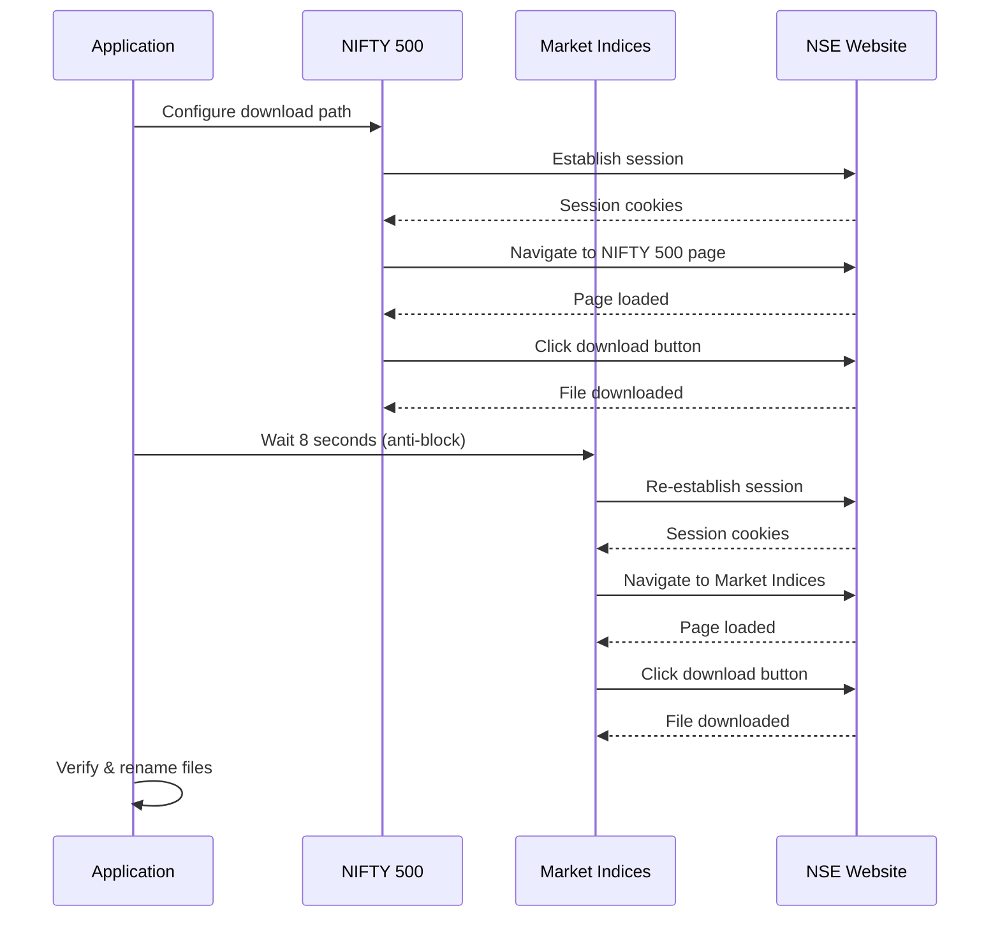

<div align="center">

# 📈 NSE Data Downloader

### *Automated NIFTY 500 & Market Indices Data Downloader*

[](https://www.python.org/downloads/)
[](https://opensource.org/licenses/MIT)
[](https://github.com/Avisav24/NSE_Data_Downloader)
[](https://github.com/Avisav24/NSE_Data_Downloader/releases)

A powerful desktop application to automatically download **NIFTY 500** and **Market Indices** data from NSE India with scheduled automation, smart file management, and weekend-aware scheduling.

[Features](#-features) • [Download](#-quick-download) • [Installation](#-installation) • [Usage](#-usage) • [Documentation](#-how-it-works)

---

</div>

## 📥 Quick Download (No Python Needed!)

<div align="center">

### 🚀 **Ready-to-Use Windows Executable**

**Latest Version: v3.0** | **Size: ~54 MB** | **Platform: Windows 10/11**

[](https://github.com/Avisav24/NSE_Data_Downloader/raw/main/releases/NSE_DataDownloader.exe)

**Direct URL**: `https://github.com/Avisav24/NSE_Data_Downloader/raw/main/releases/NSE_DataDownloader.exe`

*Or browse the [releases folder](releases/) for all versions*

</div>

---

## ✨ What's New in v3.0

<table>
<tr>
<td width="50%">

### 🎯 New Features
- 📊 **Dual-Source Downloads**  
  Download from both NIFTY 500 AND Market Indices simultaneously
  
- 🗓️ **Weekend Detection**  
  Automatically skips Sat & Sun (market closed)
  
- 📁 **Separate Folders**  
  Each source saves to its own directory
  
- 🏷️ **Enhanced File Naming**  
  Format: `NIFTY500_031025-1425min.csv`

</td>
<td width="50%">

### ⚡ Improvements
- 🎨 **Compact GUI**  
  Redesigned 680×450px interface
  
- 📊 **28 Progress Stages**  
  Detailed progress with percentages
  
- 🖥️ **Startup Ready**  
  Perfect for Windows startup apps
  
- ⚡ **Faster Downloads**  
  CDP download path control

</td>
</tr>
</table>

---

## 🎯 Features

<details open>
<summary><b>📦 Core Capabilities</b></summary>

<br>

| Feature | Description |
|---------|-------------|
| 📥 **Dual-Source Downloads** | Simultaneously download from NIFTY 500 AND Market Indices |
| 📅 **Weekend-Aware Scheduling** | Auto-skips Saturday & Sunday (market closed) |
| 📂 **Separate Folders** | `NSE_Data/NIFTY500/` & `NSE_Data/Market_Indices/` |
| 🔇 **Hidden Browser Mode** | Completely background operation - no visible window |
| 📊 **28-Stage Progress** | Real-time feedback from "Configuring" to "Complete!" |
| ⏰ **Multiple Schedule Times** | Set unlimited download times (e.g., `09:30, 12:00, 15:30`) |
| 🎯 **Manual Download** | Instant downloads with a single click |
| 📁 **Custom Locations** | Choose separate paths for each data source |

</details>

<details open>
<summary><b>🧠 Smart Features</b></summary>

<br>

```
File Naming Format: {source}_ddmmyy-hhmmmin.csv

Examples:
✓ NIFTY500_031025-1425min.csv       (Oct 3, 2025 at 2:25 PM)
✓ MarketIndices_031025-0930min.csv  (Oct 3, 2025 at 9:30 AM)
```

- ✅ **Smart Download Detection** - Waits for completion (file size stability check)
- ✅ **Multi-Location Search** - Checks configured AND default Downloads folder
- ✅ **Duplicate Handling** - Auto-increments filename (`_1`, `_2`, etc.)
- ✅ **Session Management** - Bypasses NSE security for each source
- ✅ **Error Recovery** - Robust ChromeDriver handling with auto-fallback
- ✅ **CDP Download Control** - Dynamic path setting per source

</details>

<details open>
<summary><b>💎 User Experience</b></summary>

<br>

- 🎨 **Compact GUI** - Efficient 680×450px interface
- 📏 **Wide Path Fields** - View full file paths (48 characters)
- 📊 **Progress Percentage** - Shows `[37%] Button clicked! Initiating download...`
- 📝 **Comprehensive Logging** - All operations in `nse_downloader.log`
- 🔇 **Background Operation** - Downloads in headless mode
- 🖥️ **Startup App Ready** - Perfect for Windows startup with weekend auto-skip
- 👌 **User-Friendly Interface** - Clear labels and intuitive design

</details>

---

## 📋 Requirements

<table>
<tr>
<th>🪟 For Windows Executable</th>
<th>🐍 For Python Version</th>
</tr>
<tr>
<td valign="top">

- ✅ Windows 10 or 11 (64-bit)
- ✅ Google Chrome installed
- ✅ Internet connection
- ✅ **No Python needed!**

</td>
<td valign="top">

- ✅ Python 3.8 or higher
- ✅ Google Chrome installed
- ✅ Internet connection
- ✅ Windows/Linux/macOS

</td>
</tr>
</table>

---

## 🚀 Installation

### 📦 Option 1: Windows Executable (Recommended)

<div align="center">

```
┌─────────────────────────────────────────────────┐
│  1. Download NSE_DataDownloader.exe            │
│  2. Double-click to run                         │
│  3. Start downloading! 🎉                       │
└─────────────────────────────────────────────────┘
```

**No installation. No dependencies. Just download and run!**

</div>

### 🐍 Option 2: Python Installation (All Platforms)

```bash
# 1. Clone the repository
git clone https://github.com/Avisav24/NSE_Data_Downloader.git
cd NSE_Data_Downloader

# 2. Install dependencies
pip install -r requirements.txt

# 3. Run the application
python nse_downloader.py
```

> 💡 **Note**: ChromeDriver is automatically managed!

---

## 💻 Usage

### 🎬 Quick Start Guide

<div align="center">


</div>

#### 1️⃣ **Launch Application**

```bash
python nse_downloader.py
```

#### 2️⃣ **Configure Settings**

<table>
<tr>
<td width="50%">

**📁 Download Locations**

Click "Browse" for each source:

```
NIFTY 500:
C:\Users\YourName\Downloads\NSE_Data\NIFTY500

Market Indices:
C:\Users\YourName\Downloads\NSE_Data\Market_Indices
```

</td>
<td width="50%">

**⏰ Schedule Times** (24-hour format)

```
Single:   09:30
Multiple: 09:30, 12:00, 15:30
Many:     09:15, 10:00, 11:00, 
          12:00, 13:00, 14:00, 15:30
```

⚠️ **Scheduled downloads: Mon-Fri only!**

</td>
</tr>
</table>

#### 3️⃣ **Start Scheduler**

- Click **"Start Scheduler"**
- Keep window open for scheduled downloads
- Auto-downloads at each configured time (Mon-Fri)
- Weekend downloads auto-skipped with notification

#### 4️⃣ **Manual Download**

- Click **"Download Now"** for immediate download
- Works **any day** (including weekends)
- Downloads from **BOTH sources** simultaneously

#### 5️⃣ **Stop Scheduler**

- Click **"Stop Scheduler"** to halt automation

---

### 📅 Schedule Time Examples

<table>
<tr>
<th>Use Case</th>
<th>Schedule Times</th>
<th>Description</th>
</tr>
<tr>
<td>🏦 <b>Market Coverage</b></td>
<td><code>09:30, 12:00, 15:30</code></td>
<td>Open, Midday, Close</td>
</tr>
<tr>
<td>⏱️ <b>Hourly Monitoring</b></td>
<td><code>09:00, 10:00, 11:00, 12:00,<br>13:00, 14:00, 15:00, 16:00</code></td>
<td>Every hour</td>
</tr>
<tr>
<td>📊 <b>Daily Snapshot</b></td>
<td><code>15:35</code></td>
<td>Single daily download</td>
</tr>
<tr>
<td>🔍 <b>Frequent Updates</b></td>
<td><code>09:30, 10:30, 11:30, 12:30,<br>13:30, 14:30, 15:30</code></td>
<td>Every 30 minutes</td>
</tr>
</table>

---

## 📁 File Naming Convention

### 📝 Format Structure

```
{SOURCE}_ddmmyy-hhmmmin.csv
    │       │      │    │
    │       │      │    └─ Suffix ("min")
    │       │      └────── Time (24hr: hhmm)
    │       └───────────── Date (ddmmyy)
    └───────────────────── Source identifier
```

### 🎯 Components Breakdown

| Component | Description | Example |
|-----------|-------------|---------|
| `{SOURCE}` | Data source | `NIFTY500` or `MarketIndices` |
| `ddmmyy` | Date format | `031025` = October 3, 2025 |
| `hhmm` | Time (24hr) | `1425` = 2:25 PM |
| `min` | Suffix | Always `min` |

### 📋 Filename Examples

<table>
<tr>
<th>Download Time</th>
<th>NIFTY 500 Filename</th>
<th>Market Indices Filename</th>
</tr>
<tr>
<td>9:30 AM</td>
<td><code>NIFTY500_031025-0930min.csv</code></td>
<td><code>MarketIndices_031025-0930min.csv</code></td>
</tr>
<tr>
<td>10:15 AM</td>
<td><code>NIFTY500_031025-1015min.csv</code></td>
<td><code>MarketIndices_031025-1015min.csv</code></td>
</tr>
<tr>
<td>2:30 PM</td>
<td><code>NIFTY500_031025-1430min.csv</code></td>
<td><code>MarketIndices_031025-1430min.csv</code></td>
</tr>
<tr>
<td>11:45 PM</td>
<td><code>NIFTY500_031025-2345min.csv</code></td>
<td><code>MarketIndices_031025-2345min.csv</code></td>
</tr>
</table>

### 🔄 Duplicate Handling

```
First download:   NIFTY500_031025-1015min.csv
Second download:  NIFTY500_031025-1015min_1.csv
Third download:   NIFTY500_031025-1015min_2.csv
```

---

## ⚙️ Configuration

Settings auto-save to `config.json`:

```json
{
  "download_paths": {
    "nifty500": "C:\\Users\\YourName\\Downloads\\NSE_Data\\NIFTY500",
    "market_indices": "C:\\Users\\YourName\\Downloads\\NSE_Data\\Market_Indices"
  },
  "scheduled_times": ["09:30", "12:00", "15:30"]
}
```

**Key Configuration Features:**

- ✅ Separate paths for each data source
- ✅ Multiple schedule times supported
- ✅ Scheduled downloads: **Monday-Friday only**
- ✅ Manual downloads: **Any day**

---

## 📊 How It Works

### 🔄 Download Process Flow

<div align="center">



</div>

### 📥 Detailed Steps

<table>
<tr>
<th colspan="2">🔵 NIFTY 500 Download</th>
</tr>
<tr>
<td>1️⃣</td>
<td>Configure download path for NIFTY 500 folder</td>
</tr>
<tr>
<td>2️⃣</td>
<td>Establish session with NSE India homepage</td>
</tr>
<tr>
<td>3️⃣</td>
<td>Navigate to NIFTY 500 page</td>
</tr>
<tr>
<td>4️⃣</td>
<td>Wait for page to load (10 seconds)</td>
</tr>
<tr>
<td>5️⃣</td>
<td>Find download button by ID <code>dwldcsv</code></td>
</tr>
<tr>
<td>6️⃣</td>
<td>Click download button</td>
</tr>
<tr>
<td>7️⃣</td>
<td>Wait 3 seconds for download initiation</td>
</tr>
</table>

<table>
<tr>
<th colspan="2">🟢 Market Indices Download</th>
</tr>
<tr>
<td>8️⃣</td>
<td>Re-establish session (8-second wait to avoid blocking)</td>
</tr>
<tr>
<td>9️⃣</td>
<td>Configure download path for Market Indices folder</td>
</tr>
<tr>
<td>🔟</td>
<td>Navigate to Market Indices page</td>
</tr>
<tr>
<td>1️⃣1️⃣</td>
<td>Wait for page to load (10 seconds)</td>
</tr>
<tr>
<td>1️⃣2️⃣</td>
<td>Find download button by ID <code>dwldcsv</code></td>
</tr>
<tr>
<td>1️⃣3️⃣</td>
<td>Click download button</td>
</tr>
<tr>
<td>1️⃣4️⃣</td>
<td>Wait 8 seconds for download complete (slower download)</td>
</tr>
</table>

<table>
<tr>
<th colspan="2">🟡 File Processing</th>
</tr>
<tr>
<td>1️⃣5️⃣</td>
<td>Verify both files downloaded successfully</td>
</tr>
<tr>
<td>1️⃣6️⃣</td>
<td>Check file size stability (download complete)</td>
</tr>
<tr>
<td>1️⃣7️⃣</td>
<td>Rename files with timestamp and source prefix</td>
</tr>
<tr>
<td>1️⃣8️⃣</td>
<td>Log success/failure for each source</td>
</tr>
</table>

---

### 🗓️ Weekend Detection Logic

```python
# Automatic weekend skip
if current_day in [5, 6]:  # Saturday (5), Sunday (6)
    log("Market is closed. Skipping download.")
    skip_download()
else:
    proceed_with_download()
```

**Behavior:**
- ✅ **Scheduled downloads**: Auto-skip Sat & Sun
- ✅ **Manual downloads**: Work any day
- ✅ **Logging**: "It's Saturday - Market is closed. Skipping."

---

### 🏷️ Smart File Renaming

```
1. Monitor download folder for new CSV files
2. Wait for file size stability (2-second check)
3. Ignore already-renamed files (starting with "NIFTY500_")
4. Auto-increment if duplicate exists
5. Apply format: {SOURCE}_ddmmyy-hhmmmin.csv
```

---

## 📝 Logging

All activities logged to `nse_downloader.log`:

```log
2025-10-01 09:30:05 - INFO - Starting download at 2025-10-01 09:30:05
2025-10-01 09:30:10 - INFO - Establishing session with NSE...
2025-10-01 09:30:15 - INFO - Navigating to NIFTY 500 page...
2025-10-01 09:30:25 - INFO - Found download button: By.ID = dwldcsv
2025-10-01 09:30:26 - INFO - [37%] Button clicked! Initiating download...
2025-10-01 09:30:35 - INFO - File renamed: 'NIFTY500_031025-0930min.csv'
2025-10-01 09:30:45 - INFO - Navigating to Market Indices page...
2025-10-01 09:30:55 - INFO - File renamed: 'MarketIndices_031025-0930min.csv'
2025-10-01 09:31:00 - INFO - Download complete! Both sources successful.
```

**Logged Information:**
- ⏰ Start/completion timestamps
- 🔍 Button detection status
- 📁 File rename operations
- ⚠️ Errors and warnings
- 📊 Progress percentages

---

## 🔧 Troubleshooting

<details>
<summary><b>❌ Download Button Not Found</b></summary>

**Issue**: Website structure may have changed

**Solutions**:
```
1. Check nse_downloader.log for details
2. Screenshot auto-saved in download folder
3. Verify Chrome is up-to-date
4. Check NSE website accessibility
```

</details>

<details>
<summary><b>⚠️ ChromeDriver Not Compatible</b></summary>

**Issue**: Chrome browser version mismatch

**Solutions**:
```
1. Update Chrome to latest version
2. Reinstall application dependencies
3. Check Chrome version: chrome://version
4. Verify ChromeDriver auto-update succeeded
```

</details>

<details>
<summary><b>⏰ Scheduled Downloads Not Working</b></summary>

**Issue**: Scheduler not running properly

**Solutions**:
```
✓ Keep application window open
✓ Prevent computer sleep mode
✓ Check status panel for confirmation
✓ Verify schedule times format (HH:MM)
✓ Confirm it's not a weekend (Sat/Sun)
```

</details>

<details>
<summary><b>🚫 DEPRECATED_ENDPOINT Error</b></summary>

**Issue**: NSE security detection

**Status**: ✅ **Already handled automatically!**

**How it's fixed**:
```
- Script visits homepage first
- Establishes session cookies
- Waits appropriate time between requests
- Uses proper user agent headers
```

</details>

<details>
<summary><b>📁 File Not Renaming</b></summary>

**Issue**: Download incomplete or permission error

**Solutions**:
```
1. Verify download folder write permissions
2. Check nse_downloader.log for errors
3. Ensure file size > 0 bytes
4. Confirm download actually completed
5. Check antivirus isn't blocking
```

</details>

<details>
<summary><b>🔍 Weekend Downloads Not Skipping</b></summary>

**Issue**: Manual download works, but should scheduled skip?

**Expected Behavior**:
```
✓ Scheduled downloads: Auto-skip weekends
✓ Manual downloads: Work any day
✓ Check logs for skip confirmation
```

</details>

---

## 🛡️ Technical Details

### 🔐 Anti-Detection Features

<table>
<tr>
<td>

- ✅ Chrome DevTools Protocol (CDP) commands
- ✅ Proper user agent headers
- ✅ Session cookie establishment
- ✅ Disabled automation flags

</td>
<td>

- ✅ JavaScript webdriver hiding
- ✅ Headless mode optimization
- ✅ Timing delays (anti-bot)
- ✅ Download path control per source

</td>
</tr>
</table>

### 🎯 Button Detection Strategy

**Primary Selector**:
```python
By.ID = "dwldcsv"
```

**Fallback Selectors** (in order):
```python
1. //span[@id='dwldcsv']
2. //*[@id='dwldcsv']
3. //span[@id='dwldcsv']/parent::*
4. Text-based selectors
5. XPath combinations
```

### 📊 Progress Tracking (28 Stages)

```
[0%]   Initializing...
[7%]   Configuring Chrome options...
[14%]  Setting up download paths...
[21%]  Launching browser...
[28%]  Establishing NSE session...
[35%]  Navigating to data page...
[42%]  Waiting for page load...
[50%]  Locating download button...
[57%]  Button clicked! Initiating download...
[64%]  Download in progress...
[71%]  Verifying file download...
[78%]  Processing second source...
[85%]  Renaming files...
[92%]  Finalizing...
[100%] Complete!
```

---

## 📦 Project Structure

```
NSE_Data_Downloader/
│
├── 📄 nse_downloader.py          # Main application
├── 📄 requirements.txt           # Python dependencies
├── ⚙️ config.json                 # User configuration (auto-created)
├── 📝 nse_downloader.log          # Activity logs (auto-created)
│
├── 📖 README.md                   # This documentation
├── 📄 LICENSE                     # MIT License
├── 🚫 .gitignore                  # Git ignore rules
│
└── 📁 releases/
    ├── NSE_DataDownloader.exe     # Windows executable
    └── README.md                  # Release notes
```

---

## 🤝 Contributing

Contributions are welcome! Here's how you can help:

<table>
<tr>
<td>

### 🐛 Report Bugs
Open an issue with:
- Description
- Steps to reproduce
- Expected vs actual behavior
- Log files

</td>
<td>

### ✨ Suggest Features
Share your ideas:
- Use case description
- Expected benefit
- Implementation suggestions

</td>
</tr>
<tr>
<td>

### 🔧 Submit Pull Requests
1. Fork the repository
2. Create feature branch
3. Make changes
4. Submit PR with description

</td>
<td>

### 📚 Improve Documentation
- Fix typos
- Add examples
- Clarify instructions
- Translate

</td>
</tr>
</table>

---

## 📄 License

<div align="center">

**MIT License**

Copyright (c) 2025 Avisav24

Permission is hereby granted, free of charge, to any person obtaining a copy of this software and associated documentation files (the "Software"), to deal in the Software without restriction, including without limitation the rights to use, copy, modify, merge, publish, distribute, sublicense, and/or sell copies of the Software.

See [LICENSE](LICENSE) file for full details.

</div>

---

## ⚠️ Disclaimer

<div align="center">

> **Important Notice**
> 
> This tool is for **educational and personal use only**.  
> Please respect NSE India's terms of service and use responsibly.
> 
> ❌ Do NOT use for commercial purposes  
> ❌ Do NOT make excessive automated requests  
> ❌ Do NOT redistribute data without proper authorization
> 
> The developers are not responsible for any misuse of this tool.

</div>

---

## 🙏 Acknowledgments

<div align="center">

<table>
<tr>
<td align="center" width="33%">

### 📊 NSE India
For providing market data

</td>
<td align="center" width="33%">

### 🤖 Selenium
For browser automation

</td>
<td align="center" width="33%">

### ⏰ Schedule
For task scheduling

</td>
</tr>
</table>

**Special thanks to all contributors and users!**

</div>

---

## 📧 Support

<div align="center">

### Need Help?

<table>
<tr>
<td align="center">

**📝 Check Logs**

Review `nse_downloader.log`  
for error details

</td>
<td align="center">

**📖 Read Docs**

Review [Troubleshooting](#-troubleshooting)  
section above

</td>
<td align="center">

**🐛 Open Issue**

Report on [GitHub Issues](https://github.com/Avisav24/NSE_Data_Downloader/issues)

</td>
</tr>
</table>

---

### 📊 Project Info

[](https://github.com/Avisav24/NSE_Data_Downloader/stargazers)
[](https://github.com/Avisav24/NSE_Data_Downloader/network/members)
[](https://github.com/Avisav24/NSE_Data_Downloader/watchers)

**Repository**: [github.com/Avisav24/NSE_Data_Downloader](https://github.com/Avisav24/NSE_Data_Downloader)  
**Version**: 3.0  
**Last Updated**: October 7, 2025  
**Maintainer**: [@Avisav24](https://github.com/Avisav24)

---

Made with ❤️ by the NSE Data Downloader Team

⭐ **Star this repo if you find it useful!** ⭐

</div>
